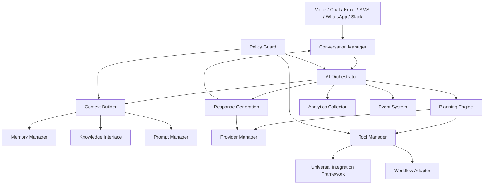

# AI Architecture Blueprint

Task 011 defines the AI Intelligence Layer for VoiceSense. It is an architecture blueprint only. It does not implement voice APIs, chat UI, RAG, workflows, tool execution, AI employees, or memory storage.

VoiceSense AI Employees must be provider-agnostic, channel-agnostic, observable, modular, secure, and scalable across thousands of organizations and millions of AI employees.

## Architectural North Star

VoiceSense is the operating system for AI employees. An AI Employee is not a prompt. It is a managed runtime composed of identity, configuration, context, memory, knowledge access, planning, tool execution, conversation state, workflow access, channel adapters, observability, and governance.

The AI layer must preserve these boundaries:

- Business modules configure AI employees; they do not call model providers directly.
- Communication channels deliver requests and responses; they do not own reasoning.
- Provider adapters call LLM/STT/TTS vendors; they do not own product policy.
- Tool execution is permissioned, logged, validated, and observable.
- Memory and knowledge are retrieved through interfaces, not hardcoded storage paths.
- Every significant AI action emits events and trace data.

## Core Components

| Component | Responsibility |
| --- | --- |
| AI Orchestrator | Coordinates the full request lifecycle for an AI employee. |
| Provider Manager | Routes model, embedding, STT, and TTS calls through provider adapters. |
| Prompt Manager | Resolves prompt templates, variables, versions, tests, and history. |
| Context Builder | Assembles relevant context under token and policy limits. |
| Memory Manager | Retrieves, updates, expires, and scopes memory layers. |
| Knowledge Interface | Provides future retrieval from documents, FAQs, websites, databases, and APIs. |
| Planning Engine | Decides next steps, tool use, clarification, delegation, and stop conditions. |
| Tool Manager | Discovers, validates, authorizes, executes, and logs tools. |
| Workflow Adapter | Invokes workflows with retries, approvals, and long-running jobs. |
| Conversation Manager | Maintains channel-agnostic conversation sessions and turns. |
| Voice Adapter | Coordinates STT, TTS, VAD, turn detection, and streaming audio providers. |
| Analytics Collector | Captures latency, usage, cost, quality, and failure metrics. |
| Policy Guard | Enforces tenant isolation, prompt-injection defenses, data masking, and permission checks. |

## Component Diagram



## AI Employee Lifecycle

### 1. Initialization

The platform loads the AI employee definition, active version, organization, workspace, policies, channels, memory settings, provider configuration, prompt references, tool permissions, and workflow permissions.

### 2. Configuration

Configuration is resolved from layered sources:

- Organization defaults
- Workspace defaults
- AI employee version
- Channel settings
- Runtime overrides
- Security and compliance policy

### 3. Startup

The runtime creates an AI session, initializes trace context, prepares provider routes, checks health gates, and emits `ai.employee.started`.

### 4. Request Processing

Incoming requests are normalized into a channel-agnostic turn object. Voice, chat, email, SMS, WhatsApp, and Slack should all enter the same reasoning pipeline.

### 5. Decision Making

The Planning Engine determines whether to answer directly, retrieve knowledge, use memory, invoke tools, ask clarifying questions, delegate to another AI employee, execute a workflow, or escalate to a human.

### 6. Tool Execution

Tools are discovered, filtered by permissions, validated against schemas, executed through the Tool Manager, logged, and converted into structured observations for the model.

### 7. Memory Updates

The Memory Manager decides whether the interaction contains durable facts, working-state updates, short-term context, shared memory, or nothing worth storing.

### 8. Response Generation

The Response Generator assembles the final response using provider adapters. The output is converted to the active channel format, and voice channels pass through TTS and streaming audio.

### 9. Shutdown

The runtime closes the session, persists final metrics, emits lifecycle events, and releases any ephemeral resources.

## AI Execution Pipeline

```text
Incoming Request
  -> Channel Normalization
  -> Tenant and Policy Guard
  -> Conversation State Load
  -> Context Builder
  -> Memory Retrieval
  -> Knowledge Retrieval
  -> Prompt Assembly
  -> Planning and Reasoning
  -> Tool Selection
  -> Permission and Parameter Validation
  -> Tool Execution
  -> Observation Integration
  -> Response Generation
  -> Channel Formatting
  -> Memory Update
  -> Analytics and Events
```

## Service Boundaries

### AI Orchestrator

The Orchestrator is the control plane for a single AI turn or job. It should remain stateless where possible and store state in durable session, conversation, trace, and memory systems.

### Provider Manager

The Provider Manager resolves the selected model provider, fallback provider, cost policy, latency policy, and capability requirements. Business logic should depend only on provider-neutral request/response contracts.

### Prompt Manager

The Prompt Manager owns prompt templates, variables, versioning, tests, evaluations, and history. No hardcoded production prompts should live in product feature code.

### Context Builder

The Context Builder ranks and compresses context from conversation history, memory, knowledge, workflow state, organization data, integration data, and active tasks.

### Tool Manager

The Tool Manager owns discovery, schema validation, permission checks, execution, retries, audit logs, and safe result shaping.

### Analytics Collector

The Analytics Collector records token usage, cost estimates, provider latency, end-to-end latency, tool timing, memory retrieval, knowledge retrieval, errors, and quality signals.

## Future Database Models

Task 011 does not implement these models, but future tasks should consider:

- `ai_provider_configs`
- `ai_sessions`
- `ai_traces`
- `prompt_versions`
- `prompt_tests`
- `context_snapshots`
- `memory_entries`
- `memory_retrievals`
- `tool_registry_entries`
- `tool_executions`
- `ai_employee_collaborations`
- `ai_response_evaluations`
- `provider_usage_records`

## Required Events

The AI layer should emit:

- `ai.employee.started`
- `ai.employee.stopped`
- `ai.conversation.started`
- `ai.request.received`
- `ai.context.built`
- `ai.memory.retrieved`
- `ai.knowledge.retrieved`
- `ai.tool.invoked`
- `ai.tool.completed`
- `ai.workflow.executed`
- `ai.response.generated`
- `ai.memory.updated`
- `ai.error.occurred`

## Scalability Principles

- Keep orchestration workers stateless.
- Use queues for long-running jobs, workflows, tool calls, and non-realtime processing.
- Use streaming paths for low-latency voice and chat.
- Store traces and snapshots asynchronously when possible.
- Support provider failover and model fallback policies.
- Partition high-volume tables by organization, workspace, and time where needed.

## Security Principles

- Enforce organization isolation at every retrieval and tool boundary.
- Treat prompt injection as hostile input.
- Never pass unrestricted integration credentials to models.
- Validate every tool call before execution.
- Mask sensitive data before prompts and logs.
- Audit all tool, workflow, and provider actions.
- Keep provider-specific secrets in the integration secret boundary.

## Blueprint Review

This architecture is provider-agnostic, channel-agnostic, memory-modular, tool-extensible, event-integrated, observable, and scalable. It is intentionally designed as the foundation for Tasks 012 onward.