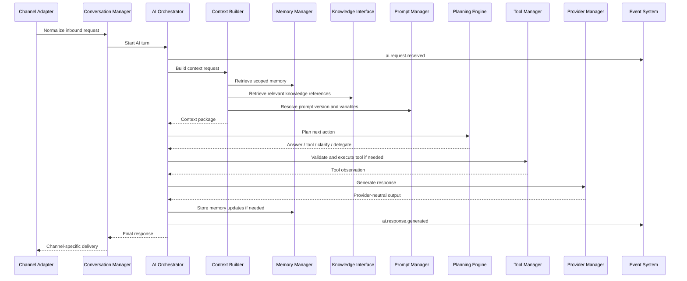
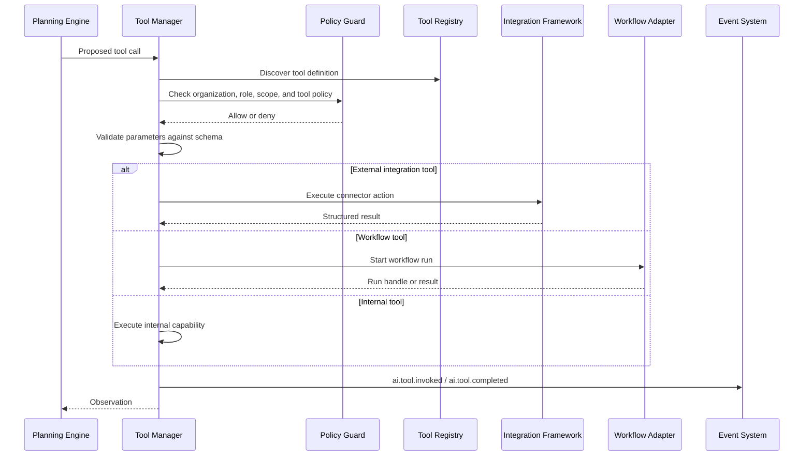
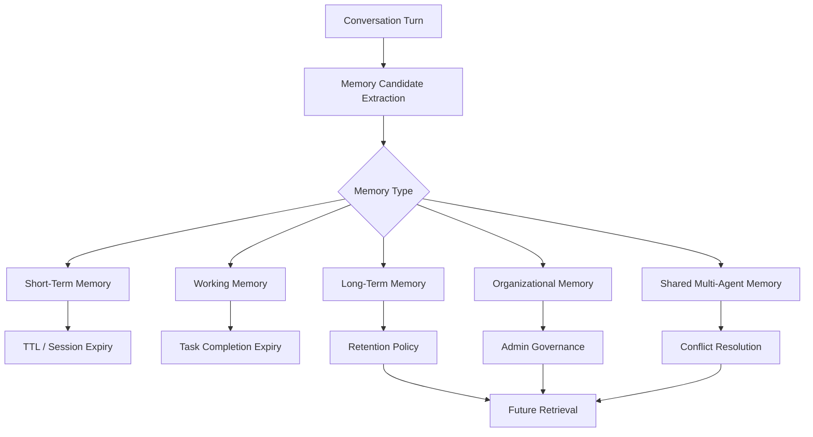
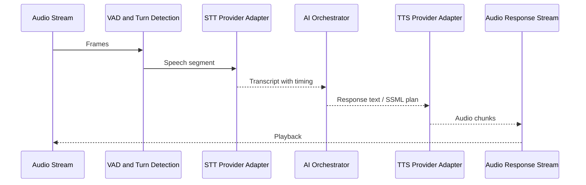
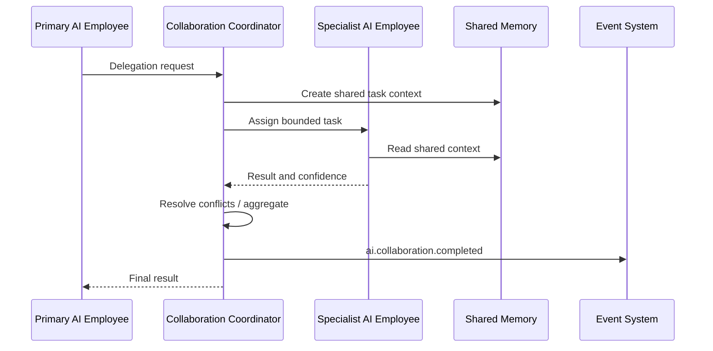

# AI Sequence and Data Flow Diagrams

These diagrams define Task 011 architecture flows. They are not implementation code.

## Request Lifecycle



## Tool Execution Flow



## Memory Lifecycle



## Voice Pipeline



## Multi-Agent Collaboration



## Data Flow Summary

```text
Channel Input
  -> normalized turn
  -> scoped context request
  -> ranked memory and knowledge references
  -> prompt package
  -> reasoning plan
  -> tool/workflow observations
  -> provider-neutral model response
  -> channel-specific response
  -> traces, events, analytics, memory updates
```