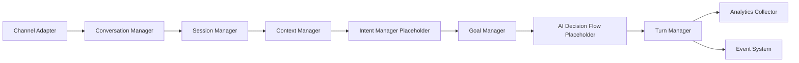

# Universal Conversation Engine Architecture

Task 014 establishes the channel-independent Conversation Engine for VoiceSense. It manages conversation state, sessions, turns, context, goals, handoff readiness, analytics, and event emission across voice, chat, SMS, WhatsApp, Slack, Teams, email, and future channels.

## Architecture

## Backend Modules

- `app.conversations.models`: aggregate root plus sessions, turns, goals, context snapshots, engine events, and analytics.
- `app.conversations.service`: conversation manager, session manager, turn manager, event emission, and analytics collection.
- `app.conversations.router`: REST API for lifecycle, session control, turns, context snapshots, handoff, and analytics.

## Channel Independence

Every adapter writes into the same conversation/session/turn model. Voice sessions can link through `voice_session_id`, but voice does not own the conversation state.

## Out of Scope

Task 014 does not implement memory persistence, RAG retrieval, workflow execution, live human agents, or provider-specific AI logic.