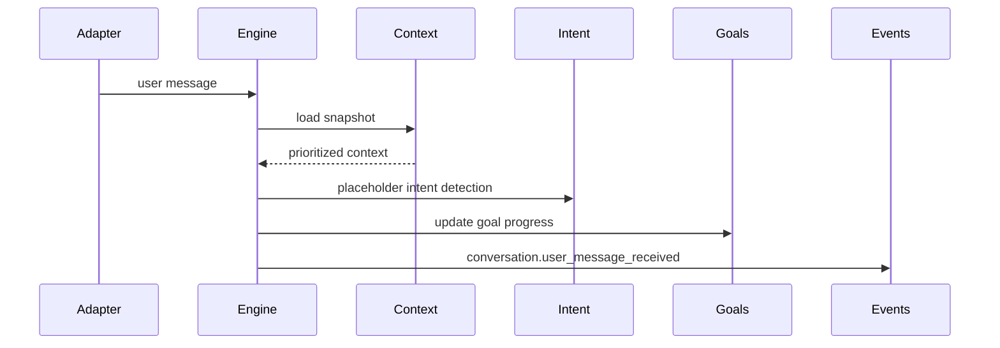
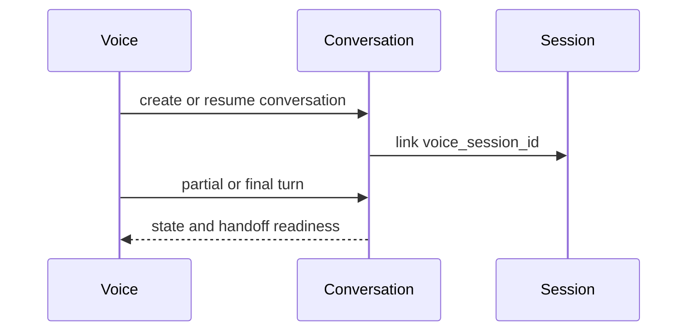
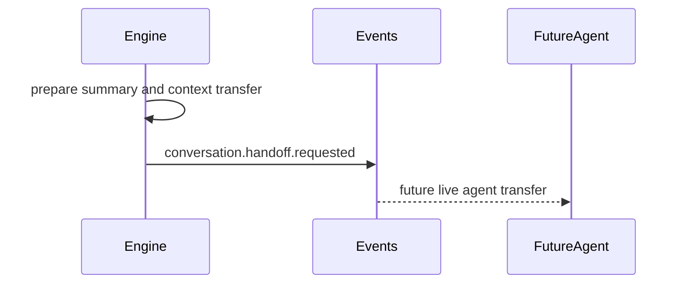

# Conversation Engine Sequence Diagrams

## Text Turn

```mermaid
sequenceDiagram
  participant Adapter
  participant Engine
  participant Context
  participant Intent
  participant Goals
  participant Events

  Adapter->>Engine: user message
  Engine->>Context: load snapshot
  Context-->>Engine: prioritized context
  Engine->>Intent: placeholder intent detection
  Engine->>Goals: update goal progress
  Engine->>Events: conversation.user_message_received
```

## Voice Conversation Link

```mermaid
sequenceDiagram
  participant Voice
  participant Conversation
  participant Session

  Voice->>Conversation: create or resume conversation
  Conversation->>Session: link voice_session_id
  Voice->>Conversation: partial or final turn
  Conversation-->>Voice: state and handoff readiness
```

## Handoff Request

```mermaid
sequenceDiagram
  participant Engine
  participant Events
  participant FutureAgent

  Engine->>Engine: prepare summary and context transfer
  Engine->>Events: conversation.handoff.requested
  Events-->>FutureAgent: future live agent transfer
```