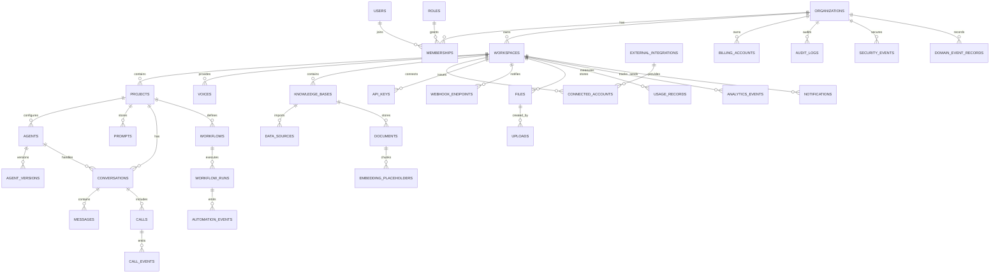

# Entity Relationship Diagram

The intended hierarchy is organization first, then workspace, then project. Product entities should avoid bypassing this hierarchy unless they are global catalog records such as `external_integrations`.

## Notification/Event Relationships

organizations -> domain_event_records -> event_logs  
domain_event_records -> notifications -> delivery_attempts  
organizations -> notification_preferences -> users  
organizations -> notification_channels  
organizations -> notification_templates  
event_subscribers -> event_logs  

## Integration Framework Relationships

external_integrations -> connector_definitions  
external_integrations -> integration_action_definitions  
external_integrations -> integration_trigger_definitions  
organizations -> connected_accounts -> integration_credentials  
connected_accounts -> connection_logs  
connected_accounts -> integration_health_checks  
connected_accounts -> domain_event_records  

## Future AI Intelligence Relationships

Task 011 is architecture-only. Future relationships should connect agents -> agent_versions -> ai_sessions -> ai_traces, ai_sessions -> context_snapshots, ai_sessions -> tool_executions, agents -> prompt_versions, agents -> memory_entries, and ai_sessions -> provider_usage_records.

## AI Employee Builder Relationships

agent_templates -> agents -> agent_versions  
agents -> agent_configurations  
agents -> agent_drafts  
agents -> agent_publishing_history -> agent_versions  
agents -> domain_event_records  

## Voice Engine Relationships

workspaces -> voice_provider_settings  
workspaces -> voice_configurations -> voice_sessions  
agents -> voice_configurations  
agents -> voice_sessions  
voice_sessions -> voice_stream_events  
voice_sessions -> voice_session_metrics  
voice_sessions -> voice_audio_metadata  
voice_audio_metadata -> files (optional, policy-controlled)  
voice_sessions -> domain_event_records  

## Universal Conversation Engine Relationships

projects -> conversations -> conversation_sessions  
conversations -> conversation_turns -> messages  
conversations -> conversation_goals  
conversations -> conversation_context_snapshots  
conversations -> conversation_engine_events  
conversations -> conversation_analytics  
conversation_sessions -> voice_sessions (optional link)  
conversations -> domain_event_records  

## Advanced Memory System Relationships

workspaces -> memory_categories -> memories  
workspaces -> memory_policies -> memories  
agents -> memories  
users -> memories  
conversations -> memories  
memories -> memory_versions  
memories -> memory_links -> memories  
memories -> memory_access  
memories -> memory_events  
workspaces -> memory_statistics  
memories -> domain_event_records  

## Enterprise Knowledge Management Relationships

workspaces -> knowledge_bases -> data_sources  
knowledge_bases -> documents -> document_versions  
knowledge_bases -> knowledge_categories -> documents  
knowledge_bases -> knowledge_folders -> documents  
knowledge_bases -> knowledge_collections  
knowledge_tags -> document_tag_assignments -> documents  
data_sources -> website_sources  
knowledge_bases -> knowledge_faqs  
knowledge_bases -> knowledge_permissions  
knowledge_bases -> knowledge_sync_jobs  
knowledge_bases -> knowledge_activity_logs  
knowledge_bases -> knowledge_quality_checks  
documents -> future RAG ingestion (not implemented in Task 016A)  
## Enterprise Retrieval Relationships

workspaces -> retrieval_provider_configs  
workspaces -> retrieval_settings -> knowledge_bases  
knowledge_bases -> retrieval_indexes -> retrieval_chunks  
documents -> retrieval_chunks  
retrieval_indexes -> embedding_jobs  
retrieval_requests -> search_logs  
retrieval_requests -> retrieval_chunks through citations  
workspaces -> retrieval_metrics  
retrieval_requests -> conversations (optional link)  
retrieval_requests -> agents (optional link)  
retrieval_chunks -> vector stores through provider-managed vector_ref  

## Enterprise Workflow Automation Relationships

workspaces -> workflows -> workflow_versions  
workflows -> workflow_nodes  
workflows -> workflow_connections  
workflow_versions -> workflow_nodes  
workflow_versions -> workflow_connections  
workflows -> workflow_runs -> workflow_execution_logs  
workflow_runs -> workflow_approval_requests  
workflows -> workflow_variables  
workspaces -> workflow_templates  
workflows -> workflow_schedules  
workflow_runs -> conversations (optional link)  
workflow_runs -> agents (optional link)  
workflows -> domain_event_records  

## Universal Tool Runtime Relationships

workspaces -> tool_categories -> tool_definitions  
tool_definitions -> tool_versions  
tool_definitions -> tool_permissions  
tool_definitions -> tool_credentials  
tool_definitions -> tool_executions -> tool_execution_logs  
tool_executions -> agents (optional link)  
tool_executions -> conversations (optional link)  
tool_executions -> workflow_runs (optional link)  
connected_accounts -> tool_credentials  
tool_definitions -> tool_health_metrics  
workspaces -> mcp_server_definitions  
tool_executions -> domain_event_records  

## Multi-Agent Collaboration Relationships

workspaces -> ai_roles  
workspaces -> ai_teams -> ai_team_members -> agents  
ai_teams -> collaboration_policies  
ai_teams -> collaboration_sessions -> delegation_events  
collaboration_sessions -> shared_contexts  
collaboration_sessions -> shared_memory_refs -> memories  
collaboration_sessions -> collaboration_messages  
collaboration_sessions -> collaboration_logs  
collaboration_sessions -> conversations (optional link)  
collaboration_sessions -> workflow_runs (optional link)  
collaboration_sessions -> agents (supervisor optional link)  
ai_teams -> collaboration_metrics  
collaboration_sessions -> domain_event_records  

## AIOps Observability Relationships

workspaces -> ops_dashboards  
workspaces -> ops_metrics  
workspaces -> ops_alerts -> ops_alert_events  
workspaces -> ops_health_reports  
workspaces -> ops_cost_records  
agents -> ops_evaluation_results  
conversations -> ops_evaluation_results  
usage_records -> metric_snapshots  
analytics_events -> ops_metrics (aggregation path)  
audit_logs -> AIOps audit center  

## Enterprise Telephony Relationships

workspaces -> telephony_provider_configs -> phone_numbers  
workspaces -> sip_endpoints  
workspaces -> call_queues -> phone_numbers  
phone_numbers -> call_routing_rules  
call_queues -> call_routing_rules  
telephony_provider_configs -> telephony_calls  
phone_numbers -> telephony_calls  
call_queues -> telephony_calls  
telephony_calls -> telephony_call_events  
telephony_calls -> call_recordings -> files (optional policy-controlled storage)  
telephony_calls -> call_metrics  
telephony_calls -> voice_sessions (optional audio runtime link)  
telephony_calls -> conversations (optional conversation link)  
telephony_calls -> workflow_runs (optional automation link)  
telephony_calls -> agents (optional AI employee link)  
telephony_calls -> domain_event_records  

## Omnichannel Communication Relationships

workspaces -> channel_configurations -> channel_sessions  
workspaces -> customer_identities -> channel_sessions  
channel_sessions -> omnichannel_messages -> delivery_events  
omnichannel_messages -> message_attachments -> files  
customer_identities -> customer_timeline_events  
channel_sessions -> customer_timeline_events  
omnichannel_messages -> customer_timeline_events  
channel_sessions -> conversations (optional unified conversation link)  
omnichannel_messages -> conversations (optional message context link)  
omnichannel_messages -> agents (optional AI employee link)  
channel_configurations -> channel_analytics  
omnichannel_messages -> domain_event_records  

## Enterprise Connector Marketplace Relationships

external_integrations -> connector_definitions -> connector_versions  
external_integrations -> connector_marketplace_metadata  
external_integrations -> connector_installations -> connected_accounts  
connected_accounts -> integration_credentials  
connected_accounts -> connector_sync_jobs  
connected_accounts -> connector_playground_runs  
connected_accounts -> connector_analytics_records  
connector_installations -> domain_event_records  

## Enterprise Developer Platform Relationships

workspaces -> api_keys -> api_request_logs  
workspaces -> oauth_applications -> oauth_access_tokens  
workspaces -> webhook_endpoints -> webhook_deliveries  
workspaces -> rate_limit_policies  
workspaces -> sandbox_resources  
workspaces -> api_explorer_runs  
api_versions -> sdk_releases  
api_versions -> cli_releases  
api_versions -> OpenAPI artifacts  

## Enterprise Billing Relationships

organizations -> billing_accounts -> subscriptions -> subscription_plans  
billing_accounts -> credit_transactions  
workspaces -> usage_records -> subscriptions  
workspaces -> billing_quotas  
billing_accounts -> invoices -> invoice_line_items  
billing_accounts -> billing_profiles  
billing_accounts -> enterprise_contracts  
billing_accounts -> payment_methods  
organizations -> discounts  
workspaces -> budget_controls  
organizations -> billing_analytics_records  

## Enterprise Security Governance Relationships

organizations -> admin_departments
organizations -> user_groups -> user_group_members -> users
organizations -> custom_roles
organizations -> governance_policies
workspaces -> governance_policies
workspaces -> abac_policies
organizations -> sso_connections
users -> mfa_factors
users -> trusted_devices
workspaces -> secret_records -> secret_versions
organizations -> compliance_frameworks -> compliance_evidence -> files
workspaces -> data_governance_policies
workspaces -> encryption_key_records
workspaces -> security_risk_events
organizations -> security_health_scores
workspaces -> governance_graph_snapshots
identity audit_logs -> security audit center
security_risk_events -> AIOps and future SIEM export paths
## VoiceSense AI Studio Relationships

workspaces -> ai_studio_prompts -> ai_studio_prompt_versions
agents -> ai_studio_prompts
agent_versions -> ai_studio_prompt_versions
workspaces -> ai_studio_prompt_templates
ai_studio_prompts -> ai_studio_playground_runs -> ai_studio_interaction_timelines
ai_studio_prompts -> ai_studio_simulation_scenarios -> ai_studio_evaluation_runs
ai_studio_test_suites -> ai_studio_test_cases
ai_studio_test_suites -> ai_studio_test_runs
ai_studio_prompt_versions -> ai_studio_benchmarks
ai_studio_prompt_versions -> ai_studio_experiments
ai_studio_prompts -> ai_studio_deployments
ai_studio_prompts -> ai_studio_comments
ai_studio_prompt_versions -> ai_studio_analytics_records
conversations -> ai_studio_interaction_timelines
conversations -> ai_studio_replay_sessions
voice_sessions -> ai_studio_replay_sessions