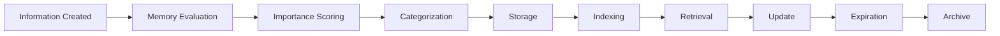

# Memory Lifecycle

Task 015 stores metadata index state only. Embeddings and vector search are future integrations.

## Actions

- Create memory
- Update memory
- Merge memories
- Archive memory
- Restore memory
- Forget memory
- Delete memory
- Pin memory
- Link memories