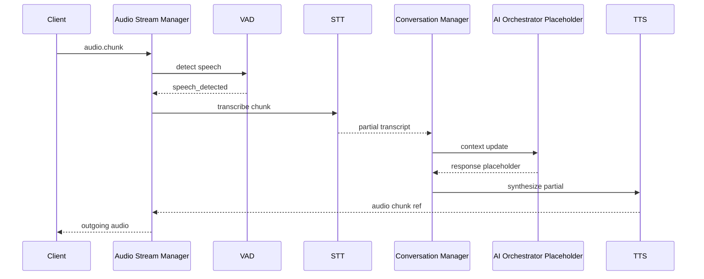
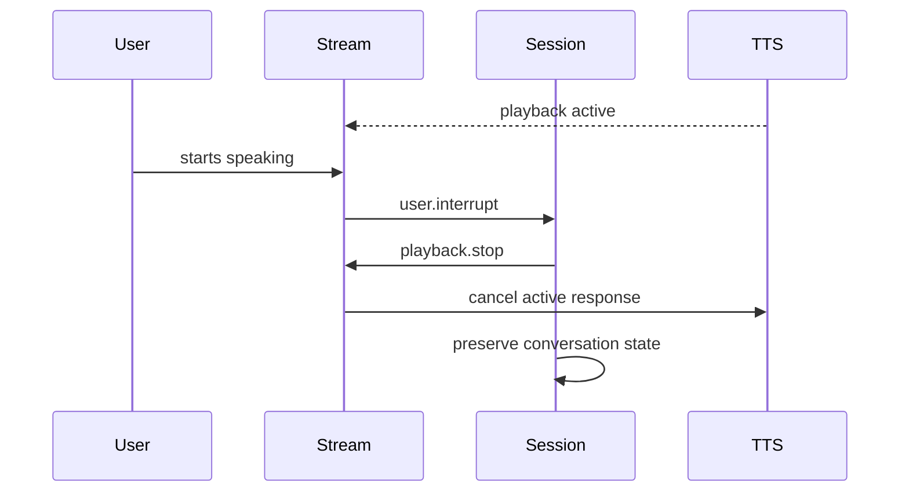
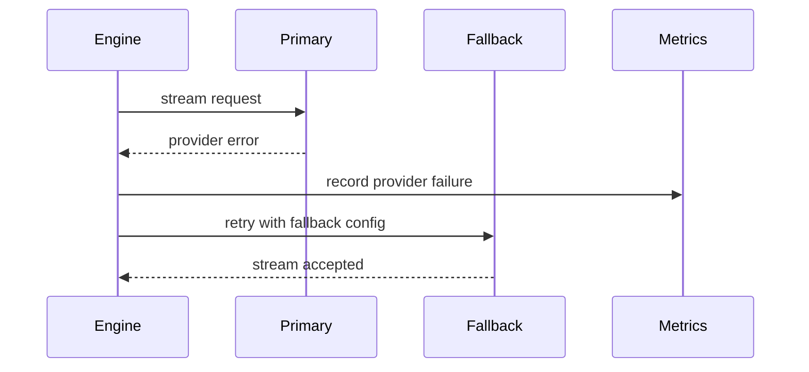

# Voice Engine Sequence Diagrams

## Streaming Turn

```mermaid
sequenceDiagram
  participant Client
  participant Stream as Audio Stream Manager
  participant VAD
  participant STT
  participant Conv as Conversation Manager
  participant AI as AI Orchestrator Placeholder
  participant TTS

  Client->>Stream: audio.chunk
  Stream->>VAD: detect speech
  VAD-->>Stream: speech_detected
  Stream->>STT: transcribe chunk
  STT-->>Conv: partial transcript
  Conv->>AI: context update
  AI-->>Conv: response placeholder
  Conv->>TTS: synthesize partial
  TTS-->>Stream: audio chunk ref
  Stream-->>Client: outgoing audio
```

## Interruption

```mermaid
sequenceDiagram
  participant User
  participant Stream
  participant Session
  participant TTS

  TTS-->>Stream: playback active
  User->>Stream: starts speaking
  Stream->>Session: user.interrupt
  Session->>Stream: playback.stop
  Stream->>TTS: cancel active response
  Session->>Session: preserve conversation state
```

## Provider Failover

```mermaid
sequenceDiagram
  participant Engine
  participant Primary
  participant Fallback
  participant Metrics

  Engine->>Primary: stream request
  Primary-->>Engine: provider error
  Engine->>Metrics: record provider failure
  Engine->>Fallback: retry with fallback config
  Fallback-->>Engine: stream accepted
```